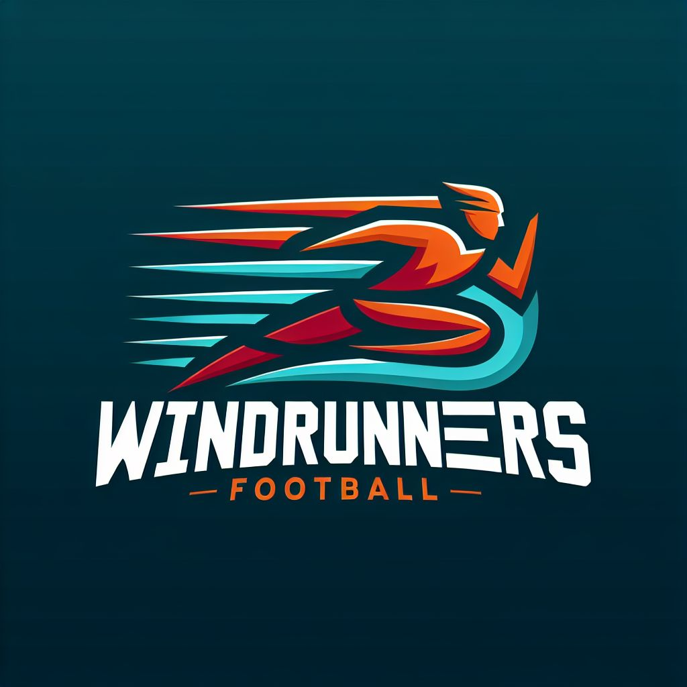

# WindRunners Football Management System

Welcome to the WindRunners Football Management System! This project combines the power of React.js and Django to provide a comprehensive platform for managing a football team's operations. With integrated APIs and PostgreSQL for database management, this system facilitates CRUD (Create, Read, Update, Delete) operations efficiently, ensuring seamless management of player data, match schedules, team statistics, and more.

## Features

### React.js Frontend
Utilizing the React.js framework, the frontend interface offers a dynamic and responsive user experience, enabling smooth navigation and interaction. The use of components and state management in React ensures that the user interface is both interactive and efficient.

### Django Backend
Powered by Django, the backend of the system ensures robust data management, authentication, and authorization, guaranteeing the security and integrity of the application. Django's ORM (Object-Relational Mapping) simplifies database interactions, making data handling more efficient.

### API Integration
Leveraging two APIs, the system connects seamlessly with external services for enriched functionality and data retrieval, enhancing the overall user experience. These integrations allow for real-time updates and interactions with other systems, broadening the scope of features available to users.

### PostgreSQL Database
The PostgreSQL database serves as the backbone of the system, providing a reliable and scalable solution for storing and retrieving data related to players, matches, teams, and more. PostgreSQL's advanced features ensure data integrity and performance, even with large datasets.

### CRUD Operations
With comprehensive CRUD functionality, users can effortlessly create, read, update, and delete records, streamlining the management of football-related data within the application. This ensures that all team data is kept up-to-date and accurate.

## Getting Started

To get started with WindRunners Football Management System, follow these steps:

### Clone the Repository
Clone this repository to your local machine using the following command:
```bash
git clone https://github.com/yourusername/windrunners.git
```

### Install Dependencies
Navigate to the project directory and install the necessary dependencies for both the frontend and backend using npm and pip:
```bash
cd windrunners/frontend
npm install
cd ../backend
pip install -r requirements.txt
```

### Database Setup
Configure the PostgreSQL database settings in the Django backend to establish a connection with your local or remote database instance. Update the `DATABASES` setting in `settings.py` with your database credentials.

### Run Migrations
Apply database migrations to create the necessary tables and schema in PostgreSQL:
```bash
python manage.py migrate
```

### Start the Servers
Run the frontend and backend servers separately to start the application. Ensure that the servers are running concurrently to enable communication between the frontend and backend:
```bash
# In one terminal window
cd frontend
npm start

# In another terminal window
cd backend
python manage.py runserver
```

## Contributing

Contributions to WindRunners Football Management System are welcome! Whether you want to fix a bug, implement a new feature, or suggest improvements, please feel free to submit pull requests. For major changes, please open an issue first to discuss the proposed changes and ensure alignment with the project goals.

## License

This project is licensed under the MIT License, which means you are free to modify and distribute the code for both personal and commercial purposes. However, attribution to the original creators is appreciated.

## Acknowledgements

- **React.js** - A JavaScript library for building user interfaces.
- **Django** - A high-level Python web framework for rapid development and clean, pragmatic design.
- **PostgreSQL** - An open-source relational database management system known for its reliability and robust features.

Thank you for using WindRunners Football Management System! We hope it makes managing your football team easier and more efficient. If you have any questions or need further assistance, please refer to our [documentation](#) or contact our support team.


